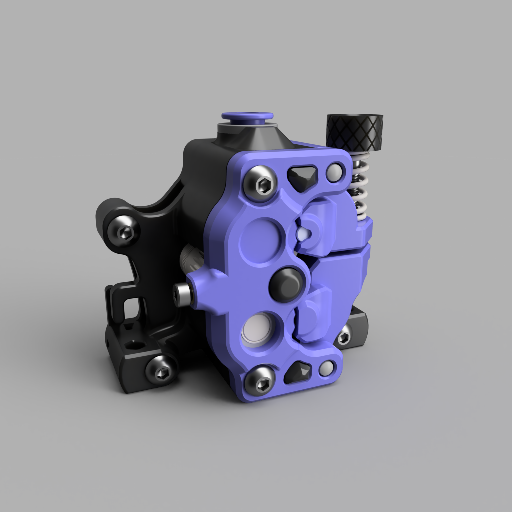

# Miró Extruder (Public **Beta**)

## General Information

The **Miró Extruder** is a high-performance, dual-drive 3D printer extruder, engineered to provide precise and reliable filament control using two sets of dual-drive gears. It features a compact design and is fully compatible with the Sherpa Mini extruder's bolt pattern.

Unlike my previous **Sherpa Mini Crew** design, the Miró is a completely new creation with no work derived from **Annex Engineering**. While it was inspired by the Sherpa Mini, the Miró is an entirely independent design, not a derivative of the Sherpa Mini extruder.

This extruder is the result of a collaboration between  **knight_rad.iant** and **wick69** in Discord, with notable testers such as **Meelis** (Discord).

For any questions, feedback, or suggestions, please use the GitHub Issues page. We appreciate your support and hope the **Miró Extruder** enhances your 3D printing experience!

> **Note:** Only STL files are provided in this repository.

---

## Bill of Materials (BOM)

| Part Name                         | Quantity | Notes                                                |
|------------------------------------|----------|------------------------------------------------------|
| 5mm OD x 8mm Length Shaft          | 1        |                                                      |
| 5mm OD x 20mm Length Shaft         | 1        |                                                      |
| MR85ZZ Bearing                     | 3        |                                                      |
| Bondtech EXT-KIT-100               | 1        |                                                      |
| Bondtech EXT-KIT33                 | 1        |                                                      |
| ECAS04 Collet                      | 1        |                                                      |
| 3mm OD x 28mm Length Shaft         | 1        |                                                      |
| M3 Nut                             | 1        |                                                      |
| NEMA 14 Pancake Stepper Motor       | 1        |                                                      |
| M2 Heat Set Insert                 | 1        |                                                      |
| M2 x 6mm Screw                     | 1        | Use Loctite to ensure alignment                      |

---

## Printing Instructions

Print **one of each** of the following parts:

- [`miró_body_x1.stl`](STLs/miró_body_x1.stl)
- [`miró_rear_x1.stl`](STLs/miró_rear_x1.stl)
- [`miró_upper_guider[a]_x1.stl`](STLs/miró_upper_guider[a]_x1.stl)
- [`miró_lower_guider[a]_x1.stl`](STLs/miró_lower_guider[a]_x1.stl)

For the front cover, choose **one** of the following options:

- [`miró_front[a].stl`](STLs/miró_front[a].stl) standard front cover
- [`miró_front_k[a].stl`](STLs/miró_front_k[a].stl) extended cover with a third attachment point

Optionally, you can print [`miró_thumbscrew.stl`](STLs/miró_thumbscrew.stl) if you prefer a printed thumbscrew over a standard M3 thumbscrew. You will also need an M3 x 25mm screw, which should be inserted into the printed part using a soldering iron with an appropriate tip.

### Recommended Print Settings
- Material: ABS
- Layer Height: 0.2mm
- Perimeters: 4
- Top/Bottom Layers: 5
- Infill: 40% or higher

Only the **guider** parts require supports (touching build plate only). Ensure that the parts are oriented for printing as shown in the provided STLs.

It’s essential to calibrate the extrusion multiplier (EM) on your printer. These parts are designed to fit tightly, and incorrect EM settings will result in improper alignment. If the main body or rear body feels too tight, reduce your EM until the parts fit comfortably.

---

## Assembly Instructions

No written assembly instructions are provided, but a video guide is available:  
[Assembly Video](resources/videos/miró_assembly.mp4)
Check it out also on [YouTube](https://www.youtube.com/watch?v=gWi4VaVpfWM)

---

## Important Assembly Notes

- The **upper drive gear** should be installed **without** the set screw.
- The **5mm x 20mm shaft** should be lubricated with EP2 grease.

When assembly is complete, use **Loctite** on the **M2 x 6mm screw** that pushes the **3mm shaft** for the middle idler. This screw is crucial for maintaining proper gear meshing, and the extruder will not function correctly without it.

### Alignment Procedure:
1. Completely loosen the tensioner.
2. Apply Loctite to the M2 x 6mm screw.
3. Tighten the screw until you feel medium resistance.
4. Manually rotate the **POM 50T gear** and check for any binding.
5. If binding occurs, loosen the screw in 1/8 turn increments, repeating the process until the binding is resolved.

---

## License

This project is licensed under the [Creative Commons - Attribution - Non-Commercial - No Derivatives](LICENSE-CC-BY-NC-ND-4.0.md) license.

For commercial use inquiries, please contact **knight_rad.iant** or **wick69** on Discord.

---

## Credits

This project is a collaboration between **wick69** and **knight_rad.iant** on Discord.

© 2023-2024 by the authors. All rights reserved.
